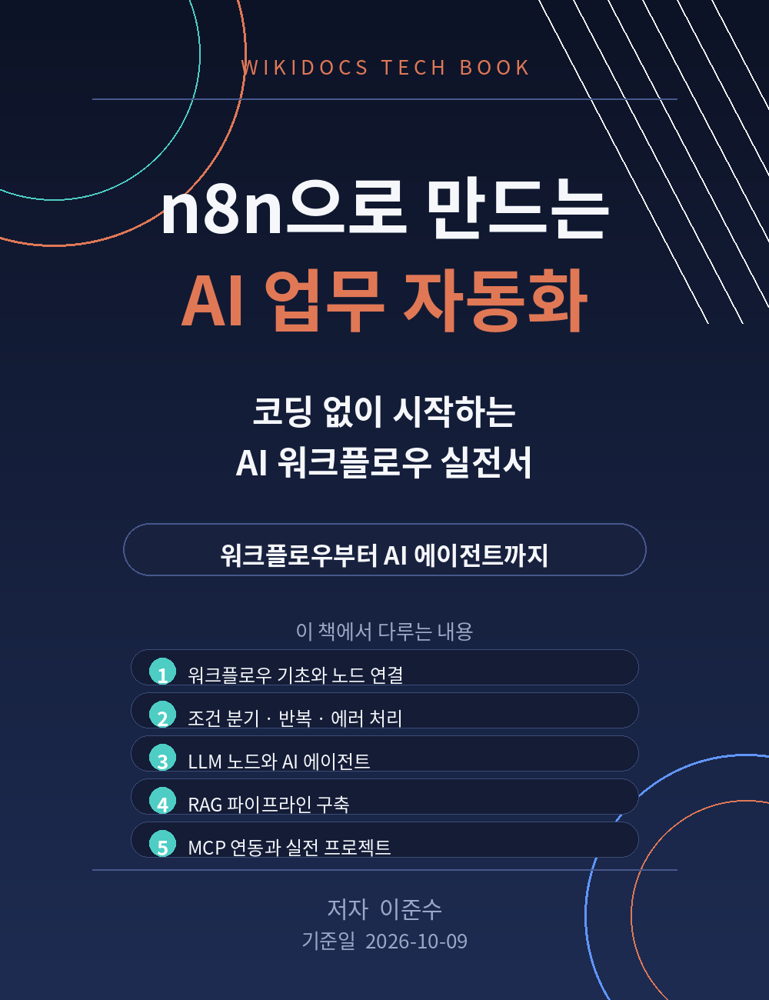

# n8n으로 만드는 AI 업무 자동화

코딩 없이 시작하는 AI 워크플로우 실전서

저자: 이준수
기준일: 2026-10-09

이 책은 위키독스에서 무료로 읽을 수 있는 공개 도서입니다.
최신 n8n 공식 문서는 https://docs.n8n.io/ 에서 함께 확인하세요.

문의: 1130dlwltn2@gmail.com
인공지능 정보공유 단톡방 참여 문의: https://open.kakao.com/o/s4OEqBai
