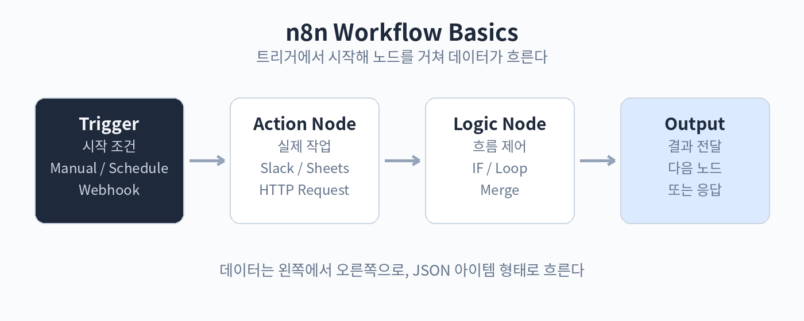

# Part 1. n8n 첫걸음

## 10. n8n이란 무엇인가

n8n은 워크플로우 자동화 도구입니다. 워크플로우란 일을 처리하는 순서도를 말합니다. 예를 들어 "매일 아침 9시에 환율 정보를 가져와서 슬랙에 올린다"는 하나의 워크플로우입니다. n8n에서는 이 순서도를 화면에 직접 그립니다. 네모난 상자(노드)를 놓고 선으로 연결하면 됩니다.

노드는 두 종류입니다. 트리거 노드는 워크플로우를 시작시키는 방아쇠입니다. 정해진 시간이 되거나, 웹훅으로 요청이 오거나, 누군가 수동으로 실행 버튼을 누르면 시작됩니다. 일반 노드는 실제 일을 하는 상자입니다. 슬랙에 메시지를 보내거나, 구글 시트에서 읽거나, AI에게 질문하는 식입니다.

n8n의 가장 큰 특징은 fair-code 라이선스의 오픈소스라는 점입니다. 직접 서버에 설치하면 무료로 쓸 수 있고, 실행 횟수 제한이 없습니다. 회사 내부에서만 쓰는 자동화라면 추가 비용 없이 돌릴 수 있습니다. 서버 관리가 부담스럽다면 n8n 클라우드를 구독해서 쓸 수도 있습니다.

비슷한 도구로 Zapier와 Make가 있습니다. Zapier는 가장 쉽고 연동되는 앱이 많지만, 실행 건수당 요금이 붙어 규모가 커지면 비용이 늘어납니다. Make는 시각적 흐름 그리기가 강점이고 가격이 합리적입니다. n8n은 세 도구 중 AI 기능이 가장 깊이 들어 있습니다. LLM과 직접 대화하는 노드, 스스로 도구를 골라 쓰는 AI 에이전트 노드, 외부 AI와 연결되는 MCP가 기본 지원됩니다. 자동화에 AI를 중심에 두고 싶다면 n8n이 자연스러운 선택입니다.

핵심 정리
- n8n은 노드를 연결해 업무 흐름을 만드는 오픈소스 자동화 도구다.
- 트리거 노드가 시작을, 일반 노드가 실제 작업을 담당한다.
- 셀프호스팅은 무료·무제한 실행, 클라우드는 구독형이다.
- AI 에이전트 노드와 MCP 지원이 강점이다.
