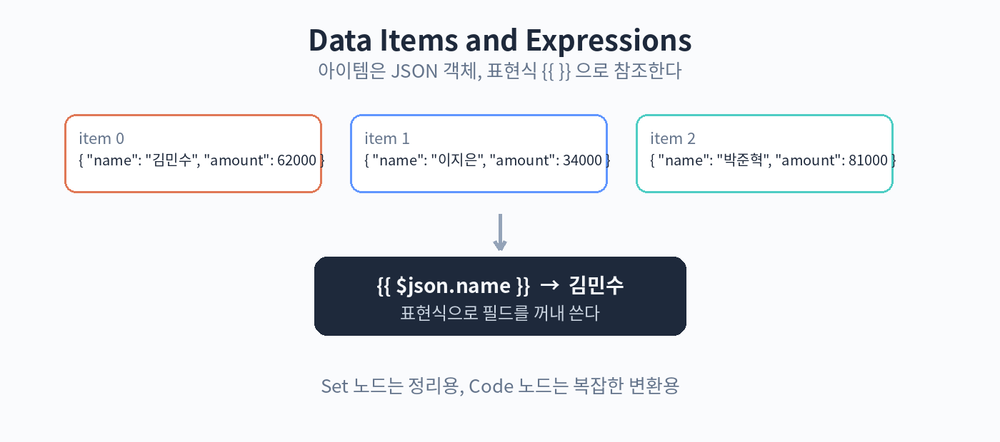

# 21. 데이터와 표현식

n8n에서 노드 사이를 흐르는 데이터는 아이템(item)이라는 단위입니다. 아이템은 JSON 객체이고, 여러 아이템이 배열 형태로 전달됩니다. 예를 들어 구글 시트에서 3행을 읽으면 아이템이 3개 생깁니다.

표현식(expression)은 이 데이터를 가공하는 문법입니다. 중괄호 두 개 {{ }} 안에 씁니다. 예를 들어 앞 노드에서 받은 이름 필드를 쓰고 싶다면 {{ $json.name }} 이라고 씁니다. $json은 현재 아이템의 JSON 데이터를 가리킵니다. 특정 노드의 출력을 직접 지정하고 싶다면 {{ $('노드이름').item.json.name }} 처럼 씁니다.

자주 쓰는 표현식을 몇 가지 익혀 둡니다. {{ $json.price * 1.1 }} 처럼 계산도 됩니다. {{ $now }} 는 현재 시간, {{ $json.items.length }} 는 배열 길이를 줍니다. 문자열 합치기는 {{ $json.first + ' ' + $json.last }} 처럼 씁니다. 표현식 입력창 옆의 도움말을 열면 사용 가능한 변수 목록이 나와서 찾아 쓰기 쉽습니다.

데이터를 새로 만들거나 바꾸는 노드는 Set(또는 Edit Fields) 노드입니다. 필드를 추가하고, 값을 직접 입력하거나 표현식으로 채웁니다. 앞 노드의 데이터를 정리해서 뒤 노드가 쓰기 좋은 형태로 만드는 용도로 자주 씁니다.

Code 노드는 JavaScript나 Python으로 직접 코드를 짜는 노드입니다. 표현식으로 처리하기 복잡한 변환, 예를 들어 여러 아이템을 하나로 합치거나 형식을 크게 바꾸는 작업에 씁니다. AI에게 맡기기 애매한 정확한 계산도 Code 노드가 담당합니다.

실습: 이름 목록 가공
1. Manual Trigger 뒤에 Set 노드를 놓고 names 배열을 만든다
2. Code 노드에서 각 이름을 "님, 안녕하세요" 형태로 바꾼다
3. 결과를 확인한다

핵심 정리
- 데이터는 JSON 아이템의 배열 형태로 흐른다.
- {{ }} 표현식으로 앞 노드의 데이터를 참조하고 가공한다.
- Set 노드는 필드 정리용, Code 노드는 복잡한 변환용이다.
