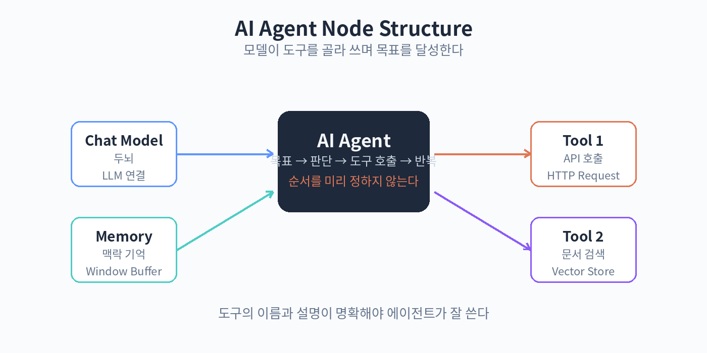

# 51. AI 에이전트 노드

AI 에이전트 노드는 모델이 스스로 도구를 골라 쓰면서 목표를 달성하는 노드입니다. LLM 노드가 "질문에 답하기"라면, 에이전트 노드는 "일을 끝내기"입니다.

에이전트 노드는 세 가지 하위 노드를 연결해서 구성합니다. Chat Model은 두뇌 역할을 하는 LLM입니다. Tools는 에이전트가 쓸 수 있는 도구 목록입니다. n8n의 일반 노드들을 도구로 연결할 수 있습니다. 예를 들어 HTTP Request 노드를 도구로 연결하면, 에이전트가 필요할 때 API를 호출합니다. Memory는 대화 맥락을 기억하는 저장소입니다.

동작 방식은 이렇습니다. 사용자가 목표를 주면, 에이전트는 어떤 도구가 필요한지 판단하고, 도구를 호출하고, 결과를 보고, 목표가 달성될 때까지 반복합니다. 개발자가 순서를 미리 정해 주지 않아도 됩니다. 예를 들어 "이번 주 매출을 정리해 줘"라고 하면, 에이전트가 매출 API 도구를 호출하고, 결과를 요약해서 돌려줍니다.

에이전트를 잘 쓰려면 도구를 잘 설계해야 합니다. 도구의 이름과 설명이 명확해야 에이전트가 언제 써야 할지 압니다. "매출 조회: 지정한 기간의 매출 합계를 돌려줍니다" 같은 설명이 좋은 예입니다. 도구가 너무 많으면 에이전트가 헷갈리니, 꼭 필요한 것만 연결합니다.

에이전트는 강력하지만 통제도 필요합니다. 중요한 작업(결제, 삭제, 외부 발송)은 에이전트가 마음대로 하지 못하게 합니다. 52장에서 다루는 휴먼인더루프와 승인 흐름을 함께 쓰면 안전합니다.

실습: 도구 쓰는 에이전트
1. AI 에이전트 노드 추가, Chat Model 연결
2. HTTP Request 노드를 도구로 연결 (날씨 API)
3. "서울 날씨를 알려줘"로 실행해 보기

핵심 정리
- 에이전트 노드는 모델+도구+메모리로 구성된다.
- 순서를 미리 정하지 않아도 목표를 향해 스스로 도구를 쓴다.
- 도구의 이름과 설명이 명확해야 잘 동작한다.
- 중요한 작업은 승인 흐름과 함께 쓴다.
