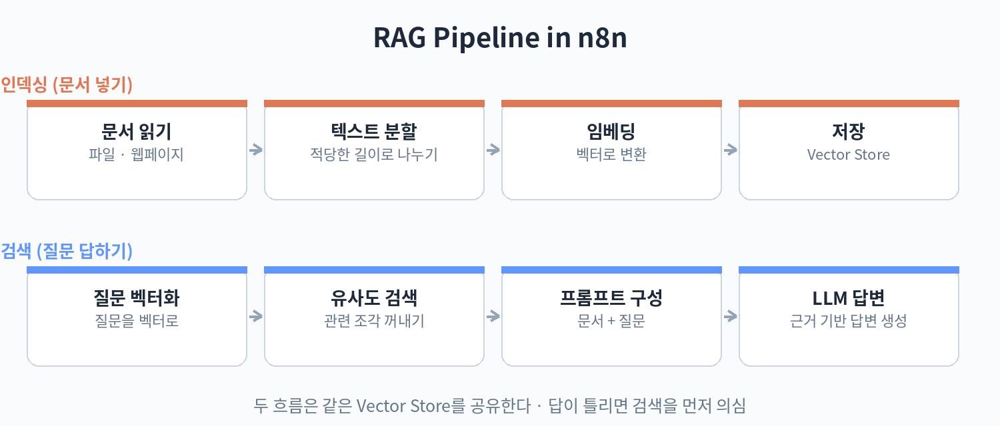

# Part 6. RAG 파이프라인

## 60. RAG 구축하기

RAG는 검색 증강 생성의 줄임말입니다. 모델이 모르는 정보(사내 문서, 최신 자료)를 미리 검색해서 프롬프트에 넣어 주고 답하게 하는 방식입니다. n8n으로는 문서 넣기와 질문 답하기, 두 개의 워크플로우로 만듭니다.

첫째, 문서 넣기(인덱싱) 워크플로우입니다. 흐름은 이렇습니다. 문서 로더 노드로 파일이나 웹페이지에서 텍스트를 읽습니다. 텍스트 분할 노드로 적당한 길이로 나눕니다. 너무 길면 검색이 뭉뚱그려지고, 너무 짧으면 맥락이 깨집니다. 임베딩 노드로 각 조각을 숫자 벡터로 바꿉니다. 벡터 스토어 노드에 저장합니다. n8n은 여러 벡터 데이터베이스를 지원하고, 간단한 용도에는 내장 옵션도 있습니다.

둘째, 질문 답하기(검색) 워크플로우입니다. 사용자가 질문하면 임베딩 노드로 질문을 벡터로 바꿉니다. 벡터 스토어에서 가장 비슷한 문서 조각 몇 개를 꺼냅니다. 꺼낸 조각을 프롬프트에 넣어 LLM 노드에게 "이 문서들을 근거로 답하세요"라고 시킵니다. 모델은 문서에 있는 내용으로만 답하므로, 없는 내용을 지어내는 일이 줄어듭니다.

RAG의 품질은 문서 나누기와 검색 설정에서 갈립니다. 조각이 너무 크면 관련 없는 내용이 섞이고, 너무 작으면 답의 근거가 부족합니다. 처음에는 기본값으로 시작해서, 실제 질문으로 테스트하며 조절합니다. 답이 엉뚱하면 검색된 조각을 먼저 확인하세요. 대부분 검색 단계의 문제입니다.

실습: 문서 Q&A
1. 짧은 안내문 3개를 텍스트로 준비하기
2. 인덱싱 워크플로우로 벡터 스토어에 넣기
3. 질문 워크플로우로 답 받아 보기

핵심 정리
- RAG는 문서 검색 결과를 프롬프트에 넣어 답하게 하는 방식이다.
- 인덱싱(넣기)과 검색(꺼내기) 두 워크플로우로 구성된다.
- 품질은 문서 나누기와 검색 설정에서 갈린다.
