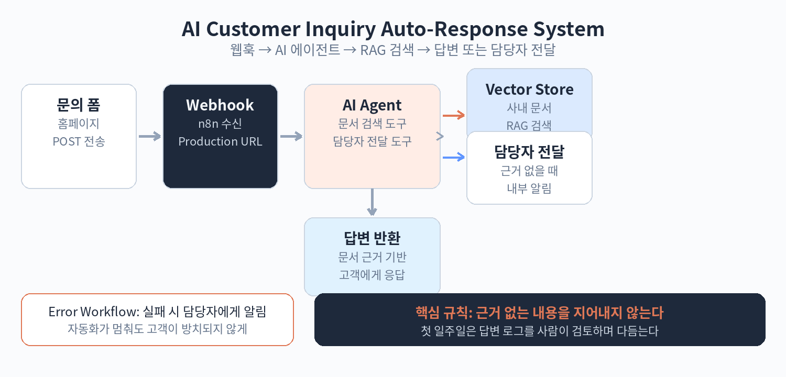

# Part 8. 실전 프로젝트

## 80. AI 고객문의 자동응대 시스템

이 장에서는 지금까지 배운 것을 하나로 묶어 실제 서비스를 만듭니다. 목표는 홈페이지 문의 폼에 들어온 고객 문의를 AI가 1차로 응대하는 시스템입니다. 문의가 오면 AI 에이전트가 사내 문서(RAG)에서 답을 찾아 답하고, 확신이 없으면 담당자에게 전달합니다.

전체 구조는 세 개의 워크플로우로 나뉩니다.

첫째, 문서 인덱싱 워크플로우입니다. 사내 FAQ와 제품 안내 문서를 벡터 스토어에 넣습니다. Part 6에서 만든 방식을 그대로 씁니다. 문서가 바뀌면 이 워크플로우를 다시 실행해 갱신합니다. 스케줄 트리거로 매주 자동 갱신되게 해 두면 관리가 편합니다.

둘째, 문의 응대 워크플로우입니다. Webhook Trigger로 시작합니다. 홈페이지 폼에서 이름, 연락처, 문의 내용이 POST로 옵니다. AI 에이전트 노드가 문의를 받습니다. 에이전트에는 두 개의 도구를 연결합니다. 하나는 벡터 스토어 검색 도구로, 사내 문서에서 관련 내용을 찾습니다. 다른 하나는 담당자 전달 도구로, HTTP Request 노드를 이용해 내부 알림을 보냅니다.

에이전트의 지침은 이렇게 정합니다. 먼저 문서 검색 도구로 답을 찾습니다. 문서에 근거가 있으면 그 내용으로 답합니다. 근거가 없거나 애매하면 "담당자가 확인 후 연락드리겠습니다"라고 답하고 담당자 전달 도구를 호출합니다. 없는 내용을 지어내지 않는 것이 이 시스템의 가장 중요한 규칙입니다.

셋째, 에러 알림 워크플로우입니다. Error Trigger로 응대 워크플로우의 실패를 받아 담당자에게 알립니다. 자동화가 멈춰도 고객이 방치되지 않게 하는 안전장치입니다.

테스트는 단계별로 합니다. 먼저 문서 검색이 잘 되는지 확인합니다. 다음으로 테스트 문의를 보내 AI의 답을 봅니다. 답이 틀리면 검색된 문서를 확인하고, 검색이 맞는데 답이 이상하면 에이전트 지침을 고칩니다. 마지막으로 담당자 전달이 정상 동작하는지 봅니다.

운영에 올릴 때는 웹훅 URL을 Production으로 바꾸고, 워크플로우를 Active로 켭니다. 첫 일주일은 AI의 답변 로그를 사람이 검토합니다. 로그는 실행 이력에서 볼 수 있습니다. 오답 패턴이 보이면 문서를 보강하거나 지침을 고칩니다. 이렇게 한두 주 다듬으면 손이 거의 안 가는 응대 시스템이 됩니다.

핵심 정리
- 문의 응대는 웹훅 + AI 에이전트 + RAG + 담당자 전달의 조합이다.
- 가장 중요한 규칙은 근거 없는 내용을 지어내지 않는 것이다.
- 첫 일주일은 답변 로그를 사람이 검토하며 다듬는다.
